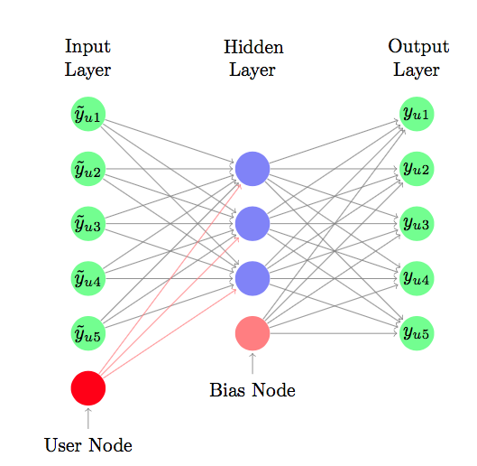
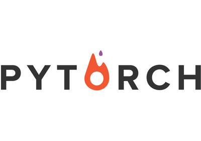
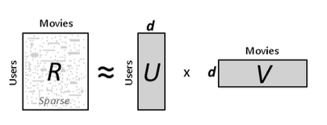

# Rec-Sys-Project
The repository contains the project did for the Recommender Systems Course at @Polimi (Politecnico di Milano - EIT Data Science Master Programme)

## Description

### Auto Encoder 

Using Python I implemented an Auto Encoder algorithm for a Recommender System Problem. In order to understand better the idea behind the method I followed the paper inside the Repo. 
[[AutoRec](http://users.cecs.anu.edu.au/~akmenon/papers/autorec/autorec-paper.pdf "AutoRec")]

#### Main Library

### ALS

After the first implementation I would like to try different libraries. For this reason I learnt how to implement an ALS using Spark.

#### Main Library

